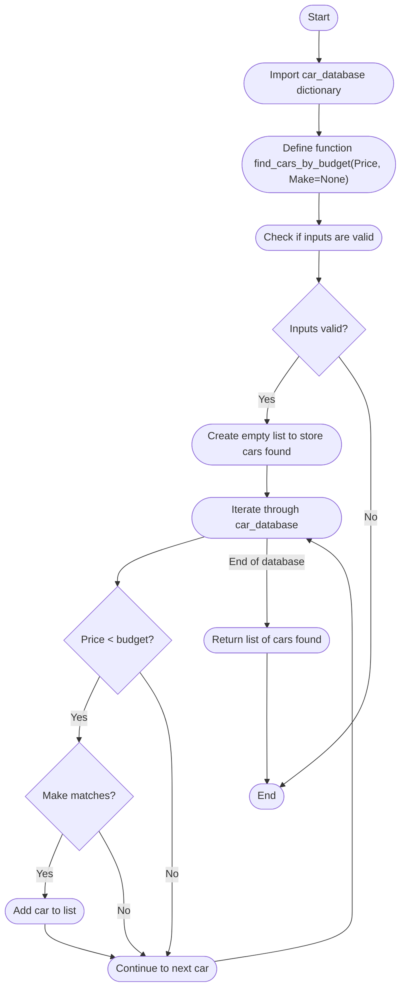

# <strong style="color:salmon"> About the Project </strong>
This project serves as part of the fulfillment of T1A2: Portfolio towards a Diploma of Information Technology at Coder Academy.

## Important Links 

Link to git repository: https://github.com/Mostofa-Abedin/-ShekhMostofaAbedin-_T1A2.git

## Built with

Python 3.10.12

## Style Guide

PEP8

## Purpose

The aim of this project is to g. 

# <strong style="color:salmon"> Features of Program </strong>

# <strong style="color:salmon"> Project Management </strong>

## Implementation plan 

### <strong style="color: #f59c42"> Main Program (main.py) </strong>
#### Outline:
#### Logic: 
### <strong style="color: #f59c42"> CSV data (car_database.csv) </strong>
#### Outline:
#### Logic: 
### <strong style="color: #f59c42"> Feature 1: Upload CSV file and store to local Dictionary  </strong>

#### File: (upload_file.py)

#### Outline: 

1.	Import CSV Module to handle CSV files.
2.	Create a blank dictionary to store vehicle data. Let’s call it car_database.
3.	Create a function called upload_file that take the argument of the file path where the csv is located.
4.	Using csv.DictReader open the csv file according to provided file path.
5.	Iterate through each row.
6.	Check if correct car details are present(make,model,year,price)
7.	If they are present add to dictonary car_database such that the key is a tuple of (make,model,year) and the value is the price.
8.	Save the information.
9.	Print a success message saying that the upload has been successful. 

#### Logic:


### <strong style="color: #f59c42"> Feature 2: Search through car database to find price of car when it was new  </strong>

#### File: (search_database.py)

#### Outline:

1.	Import the car_database dictionary base created in function 1.
2.	Create a function called search_database that takes the arguments of (Make,Model,Year). 
3.	Check that the inputs provided are valid.
4.	If valid, iterate throw each row in car_database
5.	Iterate until exact car is found.
6.	Return the price of the car.

#### Logic:

```mermaid
graph TD
  A([Start])
  B[Import car_database dictionary]
  C[Define function search_database with inputs Make, Model, Year]
  D[Check if inputs are valid]
  E{Inputs valid?}
  F[Iterate through car_database]
  G{Car found?}
  H[Return price of the car]
  I[Log error: Invalid inputs]
  J([End])

  A --> B
  B --> C
  C --> D
  D --> E
  E -->|Yes| F
  E -->|No| I
  F --> G
  G -->|Yes| H
  G -->|No| F
  H --> J
  I --> J
 ```
### <strong style="color: #f59c42"> Feature 3: Append Car Database </strong>

#### File: (append_database.py)

#### Outline:

1.	Import the car_database dictionary base created in function 1.
2.	Create a function called append_database that takes the arguments of (Make,Model,Year,Price). 
3.	Check that the inputs provided are valid.
4.	Add the car to the database where the key is a tuple of Make,Model,Year and the value is Price.
5.	Print success message

#### Logic:

```mermaid
graph TD
  A([Start])
  B[Import car_database dictionary]
  C[Define function append_database takes inputs Make, Model, Year, Price]
  D[Check if inputs are valid]
  E{Inputs valid?}
  F[Add car to database key: Make, Model, Year, value: Price]
  G[Print success message]
  H[Log error: Invalid inputs]
  I([End])

  A --> B
  B --> C
  C --> D
  D --> E
  E -->|Yes| F
  E -->|No| H
  F --> G
  G --> I
  H --> I
```
### <strong style="color: #f59c42"> Feature 4: Estimate car price today based on depreciation and mileage. </strong>

#### File: (estimate_price.py)

#### Outline:


1.	Import the search_database fuction created in feature 2
2.	Import datetime module.
3.	Import math module.
4.	Create a function called estimate_price that takes the arguments of (Make,Model,Year,Mileage). 
5.	Check that the inputs provided are valid.
6.	Use search_database to find car from inputs provided and store to variable called base price
7.	If car not found using search_database return “car not found”
8.	Calculate depreciation and milage adujustment
a.	Set depreciation rate to 5% per year.
b.	Set mileage adjustment factor to 0.01 per mile.
9.	Calculate age of car using datetime module
10.	Calculate current price of car based on formula price = base_price - (depreciation_rate * years_old * base_price) + (mileage_adjustment_factor * mileage)
11.	Return calculated price.

#### Logic:


### <strong style="color: #f59c42"> Feature 5:  </strong>

#### File: (find_cars_by_budget.py)

#### Outline:

1.	Import the car_database dictionary base created in feature 1.
2.	Create a function called find_cars_by_budget that takes the arguments of (Price,Make). Or Make = none
3.	Check that the inputs provided are valid. 
4.	Create empty list to store cars found.
5.	Iterate through car_database to find cars that satisfy:
a.	Price < budget
b.	Make matches Make (Optional)
6.	Car found within those criteria returned to list.


#### Logic:


## Project Management Software

### Platform

For my project, I decided to use the agile based project mangement software JIRA. It is a popular project management tool that is widely used in software development due to its robust data tracking and agile project management capabilities. 

### Methodology

Sprint Duration: 7 days


### Tickets

Epics:
2 Epics: 
- Application Coding
- Documentation & Research 


| Story name                                   | Story points | Subtask name                                | Epic                       | Original Estimate (days) | Priority    |
|----------------------------------------------|--------------|---------------------------------------------|----------------------------|--------------------------|-------------|
| Set Up Basic Infrastructure (CAP-33)         | 3            | Initialize Project Repository (TAP-21)      | Application Coding         | 0.5                      | Medium      |
|                                              |              | Create Folders and Structure (TAP-22)       | Application Coding         | 0.5                      | Medium      |
|                                              |              | Create Car Dictionary Structure (TAP-26)    | Application Coding         | 0.5                      | Medium      |
|                                              |              | Create Main.py file (TAP-27)                | Application Coding         | 0.5                      | Medium      |
|                                              |              | Create empty files for each feature (TAP-28)| Application Coding         | 0.5                      | Medium      |
| Set Up Documentation Structure (CAP-32)      | 2            | Create Readme file and add headers and sections (TAP-31)| Documentation & Research   | 0.5                      | Low         |
|                                              |              | Create Requirements.txt (TAP-32)            | Documentation & Research   | 0.5                      | Low         |
| Feature 1: Implement File Upload Functionality (CAP-34)| 5 | Implement Function to Read CSV File (TAP-12)| Application Coding         | 1                        | Highest     |
|                                              |              | Populate Car Dictionary (TAP-13)            | Application Coding         | 0.5                      | Highest     |
|                                              |              | Handle File Reading Errors 1 (TAP-14)       | Application Coding         | 0.5                      | Highest     |
| Feature 1: Documentation (CAP-35)            | 2            | Write Pseudocode 1 (TAP-39)                 | Documentation & Research   | 0.5                      | Medium      |
|                                              |              | Update Documents 1 (TAP-40)                 | Documentation & Research   | 0.5                      | Medium      |
| Feature 2: Implement Search and Append Functionality (CAP-36)| 5 | Implement Search Function (TAP-24)          | Application Coding         | 1                        | Highest     |
|                                              |              | Implement Append Function (TAP-25)          | Application Coding         | 0.5                      | Highest     |
| Feature 2: Documentation (CAP-37)            | 2            | Write Pseudocode 2 (TAP-41)                 | Documentation & Research   | 0.5                      | Medium      |
|                                              |              | Update Documents 2 (TAP-42)                 | Documentation & Research   | 0.5                      | Medium      |
| Feature 3: Implement Used Car Price Estimation (CAP-38)| 5 | Collect User Input for Car Details (TAP-10) | Application Coding         | 0.5                      | Highest     |
|                                              |              | Implement Price Estimation Formula (TAP-11) | Application Coding         | 1                        | Highest     |
| Feature 3: Documentation (CAP-39)            | 2            | Write Pseudocode 3 (TAP-37)                 | Documentation & Research   | 0.5                      | Medium      |
|                                              |              | Update Documents 3 (TAP-43)                 | Documentation & Research   | 0.5                      | Medium      |
| Feature 4: Implement Car Finder Based on Budget (CAP-40) | 5 | Collect User Input for Budget (TAP-15)      | Application Coding         | 0.5                      | Highest     |
|                                              |              | Implement Budget-Based Car Finder Function (TAP-16) | Application Coding         | 1                        | Highest     |
| Feature 4: Documentation (CAP-41)            | 2            |                                             | Documentation & Research   | 0.5                      | Medium      |
| Integration and Testing 1 (CAP-42)           | 8            |                                             | Application Coding         | 2                        | Medium      |
| Additional Changes and Features (CAP-43)     | 8            |                                             | Application Coding         | 2                        | Medium      |
| Integration and Testing 2 (CAP-44)           | 8            |                                             | Application Coding         | 2                        | Medium      |
| Finalize Documentation (CAP-45)              | 3            |                                             | Documentation & Research   | 1                        | Low         |
| Final Review and Deployment (CAP-46)         | 8            |                                             | Application Coding         | 2                        | Medium      |
| Placeholder 1 (CAP-47)                       | 1            |                                             | Application Coding         | 0.5                      | Low         |
| Placeholder 2 (CAP-48)                       | 1            |                                             | Application Coding         | 0.5                      | Low         |
| Placeholder 3 (CAP-49)                       | 1            |                                             | Application Coding         | 0.5                      | Low         |


