# <strong style="color:salmon"> Table of contents </strong>

- [About the Project](#about-the-project)
  - [Important Links](#important-links)
  - [Built with](#built-with)
  - [Modules used](#Modules-used)
  - [Style Guide](#style-guide)
- [Introduction](#introduction)
  - [Car Dealership Management System](#car-dealership-management-system)
- [Requirements](#requirements)
  - [Hardware Requirements](#hardware-requirements)
  - [Software Requirements](#software-requirements)
- [Step-by-Step Installation Instructions](#step-by-step-installation-instructions)
  - [1. Use Local Copy or Clone Git Repository](#1-use-local-copy-or-clone-git-repository)
  - [2. Navigate to the Project Directory](#2-navigate-to-the-project-directory)
  - [3. Verify Your Directory](#3-verify-your-directory)
  - [4. Make Shell Scripts Executable](#4-make-shell-scripts-executable)
  - [5. Run the Program](#5-run-the-program)
  - [Additional Notes](#additional-notes)
- [How to use the program](#how-to-use-the-program)
  - [Main Program](#main-program)
  - [Feature 1: Upload CSV file and store to local Dictionary](#feature-1-upload-csv-file-and-store-to-local-dictionary)
    - [Steps](#steps)
  - [Feature 2: Search through car database to find price of car when it was new](#feature-2-search-through-car-database-to-find-price-of-car-when-it-was-new)
    - [Steps](#steps-1)
  - [Feature 3: Append Car Database](#feature-3-append-car-database)
    - [Steps](#steps-2)
  - [Feature 4: Estimate car price today based on depreciation and mileage](#feature-4-estimate-car-price-today-based-on-depreciation-and-mileage)
    - [Steps](#steps-3)
  - [Feature 5: Find all cars in database that meet budget and Make requirements](#feature-5-find-all-cars-in-database-that-meet-budget-and-make-requirements)
    - [Steps](#steps-4)
- [Project Management](#project-management)
  - [Code Implementation plan](#code-implementation-plan)
  - [Feature 1: Upload CSV file and store to local Dictionary](#feature-1-upload-csv-file-and-store-to-local-dictionary)
  - [Feature 2: Search through car database to find price of car when it was new](#feature-2-search-through-car-database-to-find-price-of-car-when-it-was-new)
  - [Feature 3: Append Car Database](#feature-3-append-car-database)
  - [Feature 4: Estimate car price today based on depreciation and mileage](#feature-4-estimate-car-price-today-based-on-depreciation-and-mileage)
  - [Feature 5: Find all cars in database that meet budget and Make requirements](#feature-5-find-all-cars-in-database-that-meet-budget-and-make-requirements)
- [Testing and Patching](#testing-and-patching)
  - [Feature 1: Upload CSV file and store to local Dictionary](#feature-1-upload-csv-file-and-store-to-local-dictionary)
  - [Feature 2: Search through car database to find price of car when it was new](#feature-2-search-through-car-database-to-find-price-of-car-when-it-was-new)
  - [Feature 3: Append Car Database](#feature-3-append-car-database)
  - [Feature 4: Estimate car price today based on depreciation and mileage](#feature-4-estimate-car-price-today-based-on-depreciation-and-mileage)
  - [Feature 5: Find all cars in database that meet budget and Make requirements](#feature-5-find-all-cars-in-database-that-meet-budget-and-make-requirements)
- [Project Tracking](#project-tracking)
  - [Platform](#platform)
  - [Methodology](#methodology)
  - [Number of Epics](#number-of-epics-2)
  - [Number of stories](#number-of-stories-18)
  - [Total story points](#total-story-points-71)
  - [Number of subtasks](#number-of-subtasks-28)
  - [Detailed breakdown of tickets](#detailed-breakdown-of-tickets)
  - [Sprint progression](#sprint-progression)
    - [Day 1](#day-1)
    - [Day 2](#day-2)
    - [Day 3](#day-3)
    - [Day 4](#day-4)
    - [Day 5](#day-5)
    - [Day 6](#day-6)
    - [Day 7](#day-7)
  - [Burn-up Chart for Sprint](#burn-up-chart-for-sprint)

# <strong style="color:salmon"> About the Project </strong>

This project serves as part of the fulfillment of T1A2: Portfolio towards a Diploma of Information Technology at Coder Academy.

### Important Links

Link to Git repository: https://github.com/Mostofa-Abedin/-ShekhMostofaAbedin-_T1A2.git

### Built with

- Language - Python 3.10.12
- Interpreter - VScode

### Modules used

**Python modules:**

- csv - Used to handle CSV file operations.
- sys - Used for system-specific parameters and functions (used in upload_file.py).
- datetime - Used to work with dates (used in estimate_price.py).
- math - Used for mathematical operations (used in estimate_price.py).

**Custom modules:**

- upload_file - It contains the upload_file function and car_database dictionary.
- search_database - It contains the search_database function.
- append_database - It contains the append_database function.
- estimate_price - It contains the estimate_price function.
- find_cars_by_budget - It contains the find_cars_by_budget function

### Style Guide

The code for this project adheres to the PEP 8 guidelines, which is the most widely adopted Python style guide. Using PEP 8 makes the code is readable, consistent, and maintainable.

- **Indentation:** At each indentation level 4 spaces.
- **Line Length:** Each line was limited to a maximum of 79 characters.
- **Naming Conventions:** Use snake_case for functions and variables.
- **Whitespace:** Avoid extraneous whitespace in the code.
- Please refer to the PEP 8 guidelines here https://peps.python.org/pep-0008/

# <strong style="color:salmon"> Introduction </strong>

### Car Dealership Management System

Welcome to the Car Dealership management system! This application allows users to manage a car database. Users are able to upload car data, search for cars, add new cars, estimate used car prices and find cars within a specific budget. Hope you find the application to your liking!

# <strong style="color:salmon"> Requirements </strong>

Before running the program, ensure your system meets the following requirements:

### Hardware Requirements

- Operating System: Windows, macOS, or Linux
- Processor: 1 GHz or faster processor
- Memory: 2 GB RAM
- Storage: 1 GB of available space

### Software Requirements

- Python 3 installed
- pip (Python package installer) installed
- Virtualenv module installed

# <strong style="color:salmon"> Step-by-Step Installation Instructions </strong>

### 1. Use Local Copy or Clone Git Repository

- Option 1: Use Local Copy <br>
  If you are reading this README file, you have likely unzipped a file named ShekhMostofaAbedin_T1A3. This unzipped folder contains all the necessary files to run the program.

- Option 2: Clone the Repository <br>
  Alternatively, you can clone the repository from GitHub using the following link: ShekhMostofaAbedin_T1A3 Repository. To do this, first note the path to the local directory where you would like to clone the repository. Then, open your terminal and execute the following commands, replacing path/to/your/local/directory with your chosen directory location.

```bash
cd path/to/your/local/directory
git clone https://github.com/Mostofa-Abedin/ShekhMostofaAbedin_T1A3.git
cd path/to/your/local/directory/ShekhMostofaAbedin_T1A3
```

### 2. Navigate to the Project Directory:

- If you have cloned the Git Repository: You are already in the right folder and do not need to do anything further.

- If you are using a local copy: Open the terminal and navigate to the root folder where you have unzipped the file. Use the following command, replacing path/to/your/local/directory with your directory location:

```bash
cd path/to/your/local/directory/ShekhMostofaAbedin_T1A3
```

### 3. Verify Your Directory

If you are in the correct folder, your terminal prompt should look like this:

```bash
user@machine:~/path/to/your/local/directory/ShekhMostofaAbedin_T1A3$
```

### 4. Make Shell Scripts Executable

To ensure the shell scripts have the necessary executable permissions, run the following commands in your terminal. Do not modify the script; simply execute it as provided. If everything is set up correctly, you will not see any output. If there are any issues, error messages will be displayed.

```bash
chmod +x check_python.sh
chmod +x check_pip.sh
chmod +x check_virtualenv.sh
chmod +x setup_virtualenv.sh
chmod +x install_packages.sh
chmod +x deactivate_virtualenv.sh
chmod +x run.sh
```

### 5. Run the Program

Finally, execute the run.sh script to set up and run the application using the command.

```bash
./run.sh
```

### Additional Notes

- **Ensure Dependencies:** <br>
  The requirements.txt file includes all necessary dependencies. The run.sh script will install these automatically. However, in case of this specific program, the requirements.txt is empty as there are dependencies that are external to Python library.

- **Virtual Environment:** <br>
  The program will create and use a virtual environment. This is to manage dependencies and avoid potential conflicts with other Python projects on your system.

- **Execution:** <br>
  The run.sh script should perform all the necessary setup checks before running the main application. Please Make sure you are in the correct project directory when you run this script.

# <strong style="color:salmon"> How to use the program. </strong>

This section provides a high-level overview of the program's features and their underlying logic. It is designed for non-technical users to understand the capabilities and functionality of the program without delving into technical specifics. For a detailed examination of the internal mechanisms of each feature, please refer to the "Code Implementation Plan" section.

## List of Features

### <strong style="color:#bc5090"> Main program </strong>

Upon running the program, you will be greeted with the main menu. The main menu asks the user to choose from 6 Options.

```bash
Welcome to the Car Dealership Management System
1. Upload to car database
2. Search car database
3. Append to car database
4. Estimate used car price
5. Find cars by budget
6. Exit
```

From each option, individual functions are run and the output in returned.

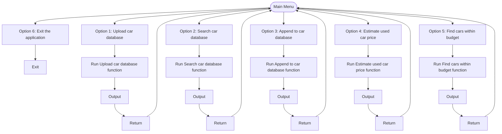

### <strong style="color:#bc5090"> Feature 1: Upload CSV file and store to local Dictionary. </strong>

From the Main menu, Option 1: Upload to car database. <br><Br>
This feature allows the user to upload a CSV format file to the local database. It asks the user to input the file path of where the file is located.

- If it the inputs are are <strong style="color:green"> valid</strong> it reads the CSV and upload to local database and prints a success message. It then exits and returns to the main menu.
- If the the inputs are <strong style="color:red"> invalid </strong>. It prints an error message and return to the main menu.

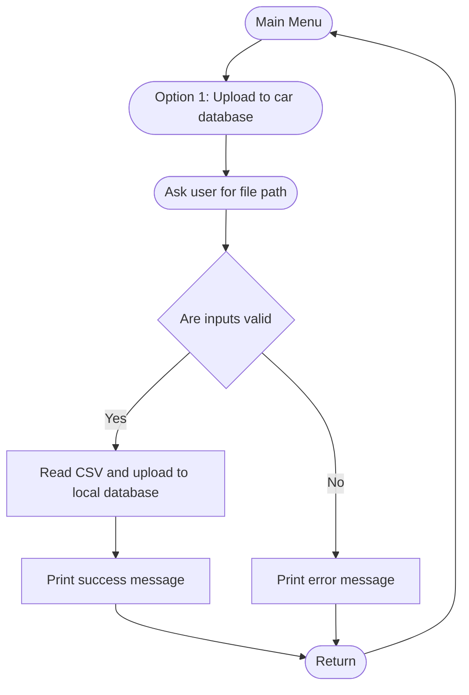

### **Steps:**

1. **Select Option 1 from the Main Menu:**
   ```bash
   Choose an option: 1
   ```
2. **Input File Path:**
   - The program will prompt you to enter the file path for the CSV file.
   ```bash
   Enter file path: /path/to/your/file.csv
   ```

**CSV File Format:**

- The CSV file must have the following headers: `Make`, `Model`, `Year`, `Price`.
- Example:

  ```csv
  Make,Model,Year,Price
  Toyota,Corolla,2020,20000
  Honda,Civic,2019,18000
  ```

  I have created a sample file called car_data.csv. It is recommended to use this csv file as it has already been populated with relevant data. The path for it is:

  ```bash
  Enter file path: ../data/car_data.csv
  ```

**Outputs:**

- **Success:** If the file has been accepted by the program.
  ```bash
  File uploaded successfully.
  ```
- **Failure:** If the file has been rejected by the program. There are 2 possible reasons:

  - If the file is not found:

  ```bash
  Error: File not found. Please check the file path.
  ```

  - If headers are missing:

  ```bash
  Error: CSV file is missing one or more required headers.
  ```

### <strong style="color:#bc5090"> Feature 2: Search through car database to find price of car when it was new. </strong>

From the Main menu, Option 2: Search car database. <br><br>
This feature allows the user to search through the car database to find the price of a specific car when it was new. It asks the user to specify the Make,Model and Year of the vehicle.

- If the inputs are <strong style="color:green"> valid</strong> it loops through the database to find the car and returns the price. It then exits back to the main menu.
- If the inputs are <strong style="color:red"> invalid </strong>, it prints an error message and returns back to the main menu.

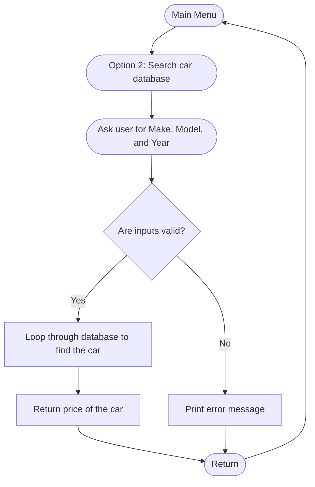

### **Steps:**

1. **Select Option 2 from the Main Menu:**
   ```bash
   Choose an option: 2
   ```
2. **Check File Upload:**
   - Program checks if a file is uploaded using option 1 before searching. There is nothing to search if the database is empty. If nothing has been uploaded, we get the error below:
   ```bash
   Please upload a file first using option 1.
   ```
3. **Input Car Details:**
   - If Option 1 has already been run. Program asks user to Enter Make, Model, and Year.
   ```bash
   Enter Make: Toyota
   Enter Model: Corolla
   Enter Year: 2020
   ```

**Outputs:**

- **Success:**
  - If a car matching the criteria is found, we get a message like the one below:
  ```bash
  The price of 2020 Toyota Corolla is 20000
  ```
- **Failure:**
  - If a no car matching the criteria is found, we get a a error message like the one below:
  ```bash
  Car not found in the database.
  ```
  - Failure could also be because inputs are invalid:
  ```bash
  Make should contain only alphabetic characters.
  ```

### <strong style="color:#bc5090"> Feature 3: Append Car Database. </strong>

From the Main menu, Option 3: Append to car database. <br><br>

This feature allows the user to add a new vehicle to the car database. It asks the user to input Make,Model and Year one by one.

- If the inputs are <strong style="color:green"> valid</strong>. The car is then appended to the car database. The user is then asked if they would also like to append to the CSV file uploaded in feature 1.
  - If the user selects <strong style="color:green"> Yes</strong>. The car is als appended to the CSV and then program exit back to main menu.
  - If the user selects <strong style="color:red"> No</strong>. The car is not appended to the CSV and then program exit back to main menu.
- If the inputs are <strong style="color:red"> invalid </strong>. Print error message and return back to main menu.

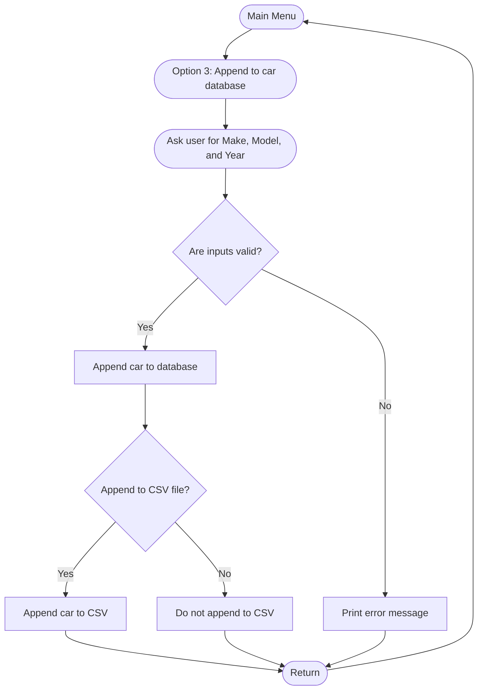

### **Steps:**

1. **Select Option 3 from the Main Menu:**
   ```bash
   Choose an option: 3
   ```
2. **Check File Upload:**
   - Program checks if a file is uploaded using option 1 before searching. There is nothing to append to if the database is empty. If nothing has been uploaded, we get the error below:
   ```bash
   Please upload a file first using option 1.
   ```
3. **Input Car Details:**
   - If Option 1 has already been run. Program asks user to Enter Make, Model, Year, and Price.
   ```bash
   Enter Make: Toyota
   Enter Model: Corolla
   Enter Year: 2020
   Enter Price: 22000
   ```
4. **Append to CSV File:**
   - The program then asks if you want to also append the new entry to the CSV file.
   ```bash
   Would you like to also append this to the CSV file? (yes/no): yes
   ```

**Outputs:**

- **Success:**
  - If the car is appended successfully, we get the message:
  ```bash
  2020 Toyota Corolla was added successfully.
  ```
  - If appended to CSV also, we get another message:
  ```bash
  2020 Toyota Corolla was added to the CSV file successfully.
  ```
- **Failure:**
  - If inputs are invalid: eg: wrong year and price variable type.
  ```bash
  Year must be an integer and Price must be a number.
  ```

### <strong style="color:#bc5090"> Feature 4: Estimate car price today based on depreciation and mileage. </strong>

From the Main menu, Option 4: Estimate used car price. <br><br>

This feature allows the user to find the estimated current market price for a vehicle. It asks the user to input Make,Model and Year one by one.

- If <strong style="color:green"> valid</strong> inputs provided, return estimated vehicle price and go back to main menu.
- If <strong style="color:red"> invalid </strong> inputs provided, return error message and go back to main menu.

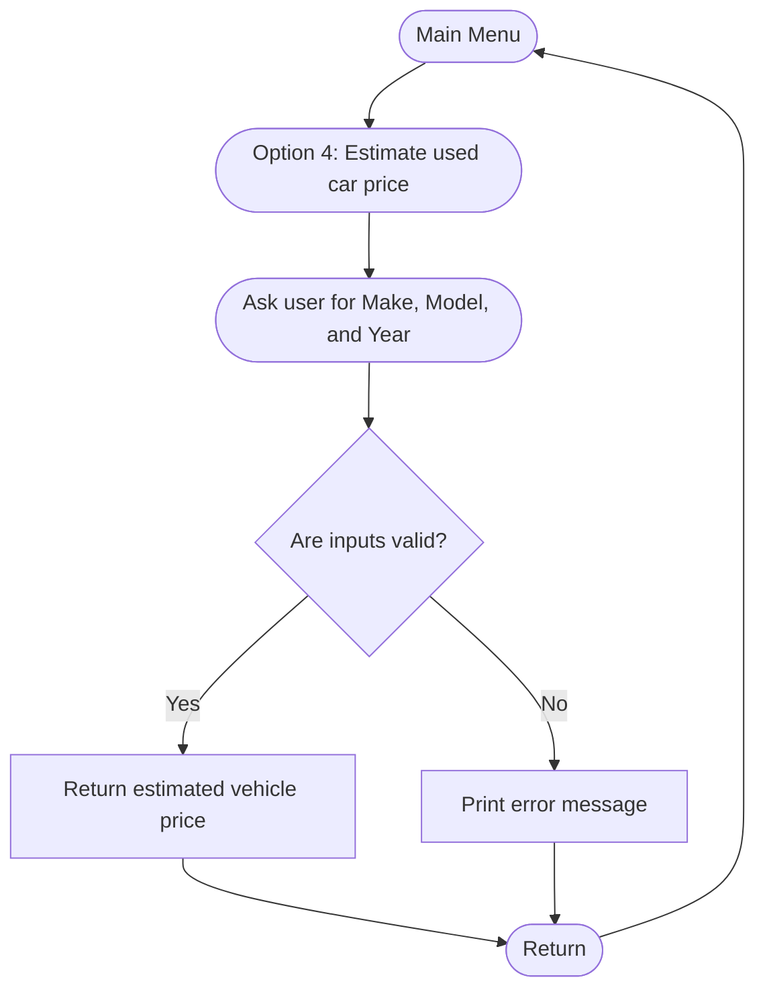

### **Steps:**

1. **Select Option 4 from the Main Menu:**
   ```bash
   Choose an option: 4
   ```
2. **Check File Upload:**
   - Program checks if a file is uploaded using option 1 before searching. We cannot estimate price if the reference database is empty. If nothing has been uploaded, we get the error below:
   ```bash
   Please upload a file first using option 1.
   ```
3. **Input Car Details:**
   - If Option 1 has already been run. Program asks user to Enter Make, Model, Year, and Mileage.
   ```bash
   Enter Make: Toyota
   Enter Model: Corolla
   Enter Year: 2020
   Enter Mileage: 15000
   ```

**Outputs:**

- **Success:**
  - The estimated price is calculated and returned.
  ```bash
  The value of a 2020 Toyota Corolla is 18000
  ```
- **Failure:**
  - If the car is not found:
  ```bash
  Car not found in the database.
  ```
  - If inputs are invalid: eg: wrong year and mileage variable type.
  ```bash
  Year must be an integer and Mileage must be a number.
  ```

### <strong style="color: #bc5090"> Feature 5: Find all cars in database that meet budget and Make requirements. </strong>

From the Main menu, Option 5: Find cars by budget. <br><br>

This feature allows the user to search through the car datbase to find all cars that are within the specified budget and Make. It asks the user to input a price and optionally also a Make.

- If <strong style="color:green"> valid</strong> inputs are provided, return a list of vehciles that match criteria
- If <strong style="color:red"> invalid </strong> inputs provided, return error message and go back to main menu.

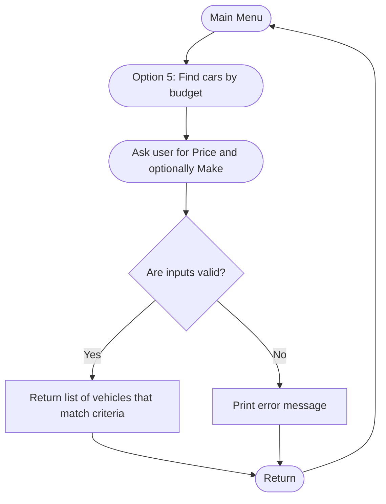

**Steps:**

1. **Select Option 5 from the Main Menu:**
   ```bash
   Choose an option: 5
   ```
2. **Check File Upload:**
   - Program checks if a file is uploaded using option 1 before searching. We cannot find vehicles if the reference database is empty. If nothing has been uploaded, we get the error below:
   ```bash
   Please upload a file first using option 1.
   ```
3. **Input Budget and Make:**
   - Program asks user to Enter Maximum Budget and optionally Make. If you want to leave Make empty, simply hit Enter.
   ```bash
   Enter Maximum Budget: 20000
   Enter Make (optional): Toyota
   ```

**Outputs:**

- **Success:**
  - If cars are found, a list of cars are returned.
  ```bash
  Make: Toyota, Model: Corolla, Year: 2000, Price: 15000.0
  Make: Toyota, Model: Corolla, Year: 2001, Price: 15500.0
  Make: Toyota, Model: Corolla, Year: 2002, Price: 16000.0
  Make: Toyota, Model: Corolla, Year: 2003, Price: 16500.0
  Make: Toyota, Model: Corolla, Year: 2004, Price: 17000.0
  Make: Toyota, Model: Corolla, Year: 2005, Price: 17500.0
  Make: Toyota, Model: Corolla, Year: 2006, Price: 18000.0
  Make: Toyota, Model: Corolla, Year: 2007, Price: 18500.0
  Make: Toyota, Model: Corolla, Year: 2008, Price: 19000.0
  Make: Toyota, Model: Corolla, Year: 2009, Price: 19500.0
  Make: Toyota, Model: Corolla, Year: 2010, Price: 20000.0
  Make: Toyota, Model: Ceres, Year: 1999, Price: 5000.0
  ```
- **Failure:**
  - If no cars are found:
  ```bash
  No cars found within the budget of 20000 for the make 'Toyota'.
  ```
  - If inputs are invalid:
  ```bash
  Make should contain only alphabetic characters.
  ```

# <strong style="color:salmon"> Project Management </strong>

## Code Implementation plan

<strong>Disclaimer -This section was initially written during the planning stage, before any code for the program was written. It has been actively updated as the project progressed. Therefore, there may be some differences between the initial plan and the final product. </strong>

### <strong style="color: #f59c42"> Main Program </strong>

#### File: (main.py)

#### Pseudocode Outline:

1. Import and load all features from their respective modules.
2. Create a main function that runs on a while loop.
3. Within the while loop, Display Main Menu Options
4. Prompt the user to choose an option.
   - Option 1: Upload car database.
   - Option 2: Search car database.
   - Option 3: Append to car database.
   - Option 4: Estimate used car price.
   - Option 5: Find cars within budget.
   - Option 6: Exit the application.
5. Based on choice, do the following.
   - Option 1: Upload File: Ask for file path
     - If correct inputs provided, upload to local database and go back to main menu.
     - If incorrect inputs provided, display error message and go to main menu.
   - Option 2: Search Database: Ask for car details and search the database.
     - If correct inputs provided, return price of vehicle and go back to main menu.
     - If incorrect inputs provided, return error message and go back to main menu.
   - Option 3: Append Database: Ask for new car details
     - If correct inputs provided, append car to database and go back to main menu.
     - If incorrect inputs provided, return error message and go back to main menu.
   - Option 4: Estimate Price: Ask for car details
     - If correct inputs provided, return estimated vehicle price and go back to main menu.
     - If incorrect inputs provided, return error message and go back to main menu.
   - Option 5: Find Cars by Budget: Ask for budget and make (optional)
     - If correct inputs provided, find cars within that budget, return list of cars and go back to main menu.
     - If incorrect inputs provided, display error message and go back to main menu.
   - Option 6: Exit: Exit the application.
6. Handle Invalid Choices: Print an error message for invalid choices.

#### Pseudocode Logic:

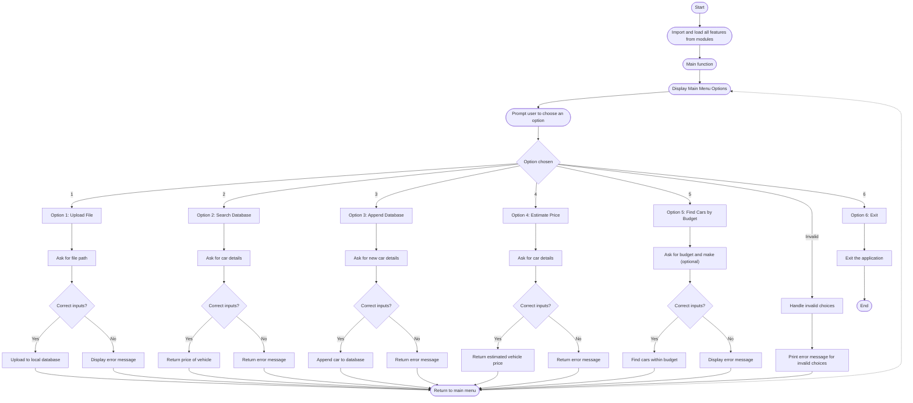

### <strong style="color: #f59c42"> CSV data </strong>

#### File: (car_database.csv)

#### Pseudocode Outline:

1. Create a simple CSV called car_database.
2. Add 4 headers to called "Make" "Model" "Year" "Price".
3. Populate the CSV with with random cars taken from the internet.
4. Place the CSV in a folder called data within the local repository and note the file path.

### <strong style="color: #f59c42"> Feature 1: Upload CSV file and store to local Dictionary </strong>

#### File: (upload_file.py)

#### Pseudocode Outline:

1. Import CSV Module to handle CSV files.
2. Create a blank dictionary to store vehicle data. Let’s call it car_database.
3. Create a function called upload_file that take the argument of the file path where the csv is located.
4. Using csv.DictReader open the csv file according to provided file path.
5. Iterate through each row.
6. Check if correct car details are present(make,model,year,price)
7. If they are present add to dictionary car_database such that the key is a tuple of (make,model,year) and the value is the price.
8. Save the information.
9. Print a success message saying that the upload has been successful.

#### Pseudocode Logic:

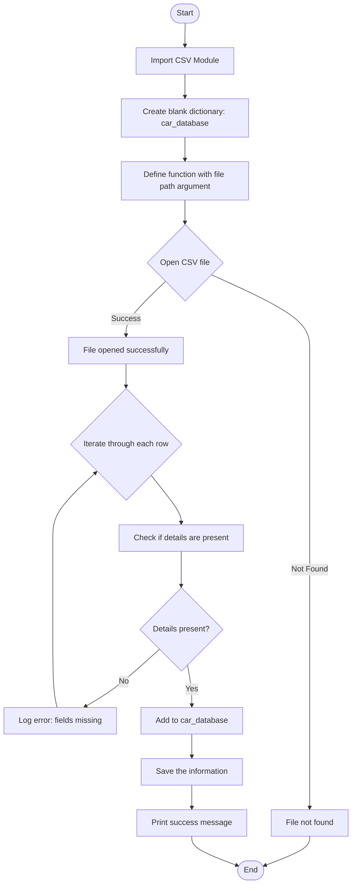

### <strong style="color: #f59c42"> Feature 2: Search through car database to find price of car when it was new </strong>

#### File: (search_database.py)

#### Pseudocode Outline:

1. Import the car_database dictionary base created in function 1.
2. Create a function called search_database that takes the arguments of (Make,Model,Year).
3. Check that the inputs provided are valid.
4. If valid, iterate throw each row in car_database
5. Iterate until exact car is found.
6. Return the price of the car.

#### Pseudocode Logic:

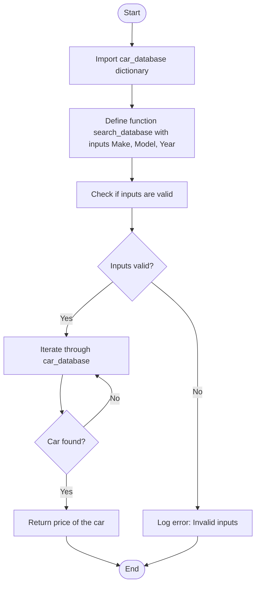

### <strong style="color: #f59c42"> Feature 3: Append Car Database </strong>

#### File: (append_database.py)

#### Pseudocode Outline:

1. Import the car_database dictionary base created in function 1.
2. Create a function called append_database that takes the arguments of (Make,Model,Year,Price).
3. Check that the inputs provided are valid.
4. Add the car to the database where the key is a tuple of Make,Model,Year and the value is Price.
5. Print success message

#### Pseudocode Logic:

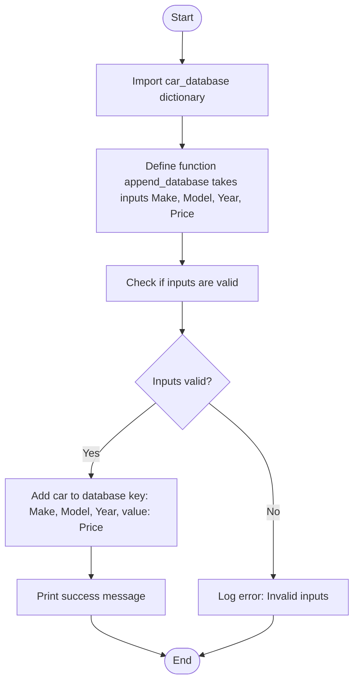

#### <strong style="color:red">\*\*New Functionality added later</strong>

During the testing and patching phase, additional functionality was introduced to Feature 3. This was done to try and meet some of the assignment/project requirements.
The new functionality works such that, the user can also choose to add the vehicle to the CSV uploaded in Feature 3.

#### Updated Pseudocode Outline:

1. Import the car_database dictionary base created in function 1.
2. Import CSV module to handle CSV files.
3. Create a function called append_database that takes the arguments of (Make,Model,Year,Price, file_path). \*File_path should be initalized as None.
4. Check that the inputs provided are valid.
5. Add the car to the database where the key is a tuple of Make,Model,Year and the value is Price.
6. Print success message
7. If file_path exists(ie:User wants to add to CSV)
8. Open CSV file and append car to last row.
9. Print second success message.

#### Updated Pseudocode Logic:

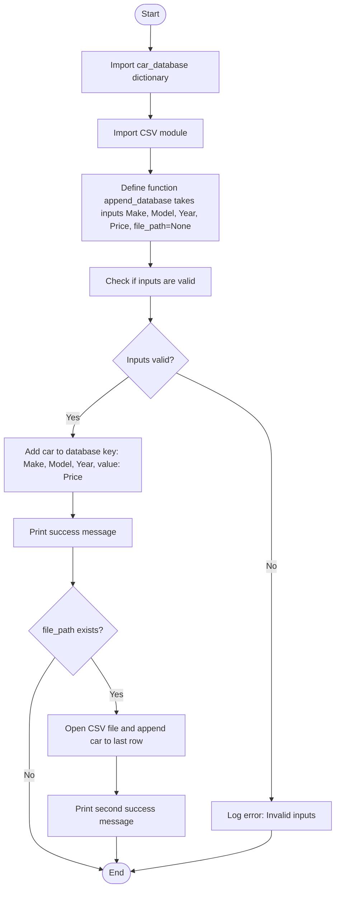

### <strong style="color: #f59c42"> Feature 4: Estimate car price today based on depreciation and mileage. </strong>

#### File: (estimate_price.py)

#### Pseudocode Outline:

1. Import the search_database fuction created in feature 2
2. Import datetime module.
3. Import math module.
4. Create a function called estimate_price that takes the arguments of (Make,Model,Year,Mileage).
5. Check that the inputs provided are valid.
6. Use search_database to find car from inputs provided and store to variable called base price
7. If car not found using search_database return “car not found”
8. Calculate depreciation and milage adujustment
   a. Set depreciation rate to 5% per year.
   b. Set mileage adjustment factor to 0.01 per mile.
9. Calculate age of car using datetime module
10. Calculate current price of car based on formula price = base*price - (depreciation_rate * years*old * base_price) + (mileage_adjustment_factor \* mileage)
11. Return calculated price.

#### Pseudocode Logic:

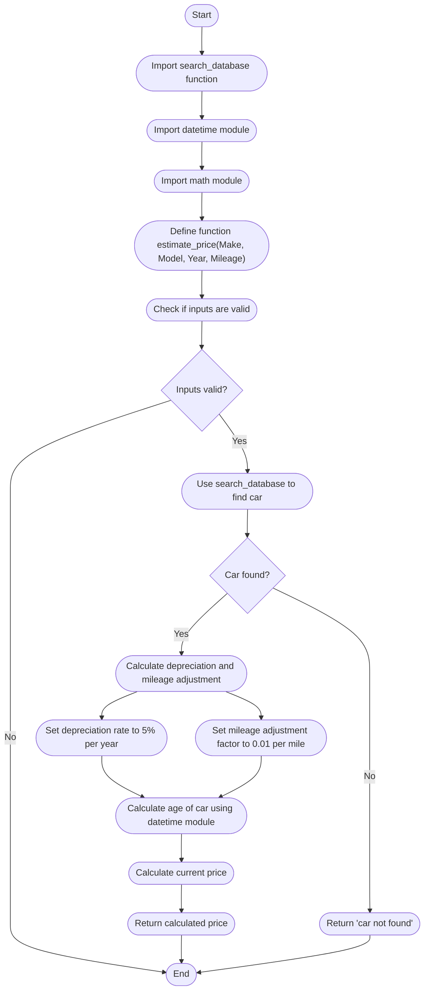

### <strong style="color: #f59c42"> Feature 5: Find all cars in database that meet budget and Make requirements </strong>

#### File: (find_cars_by_budget.py)

#### Pseudocode Outline:

1.  Import the car_database dictionary base created in feature 1.
2.  Create a function called find_cars_by_budget that takes the arguments of (Price,Make). Or Make = none
3.  Check that the inputs provided are valid.
4.  Create empty list to store cars found.
5.  Iterate through car_database to find cars that satisfy:
    - Price < budget
    - Make matches Make (Optional)
6.  Car found within those criteria returned to list.

#### Pseudocode Logic:

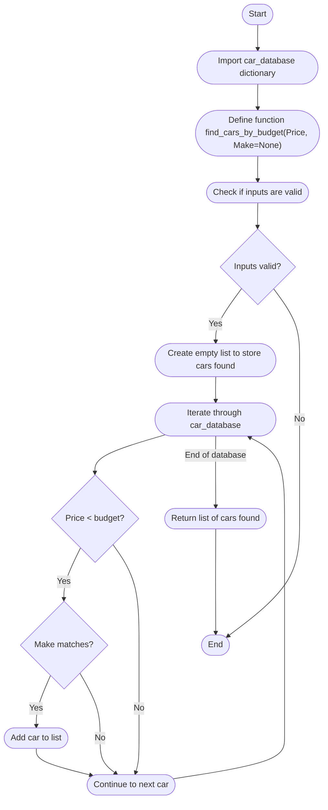

## Testing and Patching

### <strong style="color: #f59c42"> Feature 1: Upload CSV file and store to local Dictionary </strong>

**Test 1: Invalid File Path**

- **Action:** Provide an incorrect file path.
- **Expected Result:** Error message indicating the file was not found.
- **Actual Result:** Error message returned.
- **Status:** OK

**Test 2: CSV with Missing Header**

- **Action:** Provide a CSV file missing one or more required headers (Make, Model, Year, Price).
- **Expected Result:** Error message indicating missing header but uploads.
- **Actual Result:** Error message returned but still uploaded. Message and detection not satisfactory.
- **Status:** Patched. Code added to detect mandatory headers. See commit aa8a2b32. -m "Testing and Patching of Feature 1:Done"

**Test 3: CSV with Missing Value**

- **Action:** Provide a CSV file where some rows have missing values for Make, Model, Year, or Price.
- **Expected Result:** Error message indicating missing value.
- **Actual Result:** Error message returned.
- **Status:** OK

**Test 4: CSV with Incorrect Value for Specific Car**

- **Action:** Provide a CSV file with an incorrect value format for a specific car (e.g., non-numeric price).
- **Expected Result:** File should still upload, but user notified of the specific row error.
- **Actual Result:** File uploaded, user notified of the error.

**Test 5: CSV with Duplicate Entries**

- **Action:** Provide a CSV file with duplicate car entries.
- **Expected Result:** File should still upload, but user notified of the specific row error.
- **Actual Result:** Did not pick up on duplicates.
- **Status:** Patched with new code inserted. See commit aa8a2b32. -m "Testing and Patching of Feature 1:Done"

### <strong style="color: #f59c42"> Feature 2: Search through car database to find price of car when it was new </strong>

**Test 1: Invalid Make Type**

- **Action:** Provide Make such that not all characters are alphabet letters.
- **Expected Result:** Returns "Make should be string" error message.
- **Actual Result:** Incorrect result. Need modification to main function.
- **Status:** Patched. Main function needed some changes. See commit:

**Test 2: Invalid Year Type**

- **Action:** Provide a non-integer value for Year.
- **Expected Result:** Returns "TypeError: Year should be an integer."
- **Actual Result:** Error message thrown. However, it is different from the expected message.
- **Status:** Keep it as it is for now.

**Test 3: Empty Car Database**

- **Action:** Search for a car when the car_database is empty.
- **Expected Result:** Returns "Car not found in the database."
- **Actual Result:** Returns as expected.
- **Status:** OK

**Test 4: Case Sensitivity in Make and Model**

- **Action:** Search for a car with different case (e.g., make instead of Make).
- **Expected Result:** Case sensitivity may cause "Car not found in the database."
- **Actual Result:** Returns as expected.
- **Status:** OK

### <strong style="color: #f59c42"> Feature 3: Append Car Database </strong>

**Test 1: Valid Inputs Without File Path**

- **Action:** Append a valid car entry without running Option 1 first.
- **Expected Result:** Error message asking the user to run option 1 first.
- **Actual Result:** Error message as expected.
- **Status:** OK

**Test 2: Invalid Make Type**

- **Action:** Provide Make such that not all characters are alphabet letters.
- **Expected Result:** Returns "Make should be string" error message.
- **Actual Result:** Incorrect result. Need modification to main function.
- **Status:** Patched. Main function needed some changes. See commit: 69a4dd6 -m "Testing and Patching of Feature 3:Done for now"

**Test 3: Invalid Year Type**

- **Action:** Provide a non-integer value for Year.
- **Expected Result:** Returns "Error: Year must be an integer and Price must be a number."
- **Actual Result:** Error message as expected.
- **Status:** OK

**Test 4: Invalid Year Type**

- **Action:** Provide a non-integer value for Price.
- **Expected Result:** Returns "Error: Year must be an integer and Price must be a number."
- **Actual Result:** Error message as expected.
- **Status:** OK

### <strong style="color: #f59c42"> Feature 4: Estimate car price today based on depreciation and mileage. </strong>

**Test 1: Invalid Make Type**

- **Action:** Provide Make such that not all characters are alphabet letters.
- **Expected Result:** Returns "Make should be string" error message.
- **Actual Result:** Incorrect result. Need modification to main function.
- **Status:** Patched. Main function needed some changes. See commit: 56220b5 m- "Testing and Patching of Feature 4:Done for now"

**Test 2: Enter Very High Mileage**

- **Action:** Provide so high mileage such that car value becomes negative.
- **Expected Result:** Message showing that car has no value.
- **Actual Result:** Incorrect result. Need modification to estimate_price function to add new message letting user know car has no value.
- **Status:** Patched. Estimate_price function needed some changes. See commit: 56220b5 m- "Testing and Patching of Feature 4:Done for now"

**Test 3: Invalid Year Type**

- **Action:** Provide a non-integer value for Year.
- **Expected Result:** Returns "Error: Year must be an integer and Price must be a number."
- **Actual Result:** Error message as expected.
- **Status:** OK

**Test 4: Invalid Mileage Type**

- **Action:** Provide a non-numeric value for mileage.
- **Expected Result:** Raises TypeError with the message "Mileage should be a number."
- **Actual Result:** Error message as expected.
- **Status:** OK

### <strong style="color: #f59c42"> Feature 5: Find all cars in database that meet budget and Make requirements </strong>

**Test 1: Invalid Make Type**

- **Action:** Provide Make such that not all characters are alphabet letters.
- **Expected Result:** Returns "Make should be string" error message.
- **Actual Result:** Incorrect result. Need modification to main function.
- **Status:** Patched. Main function needed some changes. See commit: a6d1582 -m "Testing and Patching of Feature 5:Done for now"

**Test 2: Enter Very Low Budget**

- **Action:** Enter so low budget that there are no cars available.
- **Expected Result:** Message showing no cars found.
- **Actual Result:** Incorrect result. Need modification to find_cars_by_budget function to add new message letting user know that there are no cars that match their criteria.
- **Status:** Patched. find_cars_by_budget function needed some changes. See commit: a6d1582 -m "Testing and Patching of Feature 5:Done for now"

**Test 3: Enter Make Not in Database**

- **Action:** Enter a make that isn’t in the database.
- **Expected Result:** Message showing Make not found in database.
- **Actual Result:** Incorrect result. Need modification to find_cars_by_budget function to add new message letting user know that make not found.
- **Status:** Patched. find_cars_by_budget function needed some changes. See commit: a6d1582 -m "Testing and Patching of Feature 5:Done for now"

## Project Tracking

### Platform

For my project, I decided to use the agile based project mangement software JIRA. It is a popular project management tool that is widely used in software development due to its robust data tracking and agile project management capabilities.

### Methodology

For this project, a new software development Scrum project was started within JIRA. After planning and learning, a sprint duration of 7 days was selected to complete the project. Tickets were created in the backlog with the following attributes.

#### Number of Epics: 2

Within JIRA, Epics are large bodies of works that can be broken down into stories and issues. For this project, we choose two main Epics.

- Application Coding
- Documentation & Research

#### Number of stories: 18

Stories are the next level down from Epics. Stories encompass the big tasks. After planning, I decided on 18 specific stories. Each story was also assigned a priority.

#### Total story points: 71

Each story was assigned an individual story point. Story points in Jira are a unit of measure used to estimate the relative effort or complexity required to complete a user story or task. Story points are required for tracking sprint progression.

For this project, I assigned story points based on the Fibonacci sequence (1, 2, 3, 5, 8, 13, etc.). The table below has the breakdown of story points by stories.

#### Number of subtasks: 28

Subtasks are yet another level down from stories. These are all the smaller tasks within a big story. Subtasks do not have their own story points.

A detailed breakdown of the tickets can be found in the table below.

| Story name                                                    | Story points | Subtask name                                             | Epic                     | Original Estimate (days) | Priority |
| ------------------------------------------------------------- | ------------ | -------------------------------------------------------- | ------------------------ | ------------------------ | -------- |
| Set Up Basic Infrastructure (CAP-33)                          | 3            | Initialize Project Repository (TAP-21)                   | Application Coding       | 0.5                      | Medium   |
|                                                               |              | Create Folders and Structure (TAP-22)                    | Application Coding       | 0.5                      | Medium   |
|                                                               |              | Create Car Dictionary Structure (TAP-26)                 | Application Coding       | 0.5                      | Medium   |
|                                                               |              | Create Main.py file (TAP-27)                             | Application Coding       | 0.5                      | Medium   |
|                                                               |              | Create empty files for each feature (TAP-28)             | Application Coding       | 0.5                      | Medium   |
| Set Up Documentation Structure (CAP-32)                       | 2            | Create Readme file and add headers and sections (TAP-31) | Documentation & Research | 0.5                      | Low      |
|                                                               |              | Create Requirements.txt (TAP-32)                         | Documentation & Research | 0.5                      | Low      |
| Feature 1: Implement File Upload Functionality (CAP-34)       | 5            | Implement Function to Read CSV File (TAP-12)             | Application Coding       | 1                        | Highest  |
|                                                               |              | Populate Car Dictionary (TAP-13)                         | Application Coding       | 0.5                      | Highest  |
|                                                               |              | Handle File Reading Errors 1 (TAP-14)                    | Application Coding       | 0.5                      | Highest  |
| Feature 1: Documentation (CAP-35)                             | 2            | Write Pseudocode 1 (TAP-39)                              | Documentation & Research | 0.5                      | Medium   |
|                                                               |              | Update Documents 1 (TAP-40)                              | Documentation & Research | 0.5                      | Medium   |
| Feature 2: Implement Search and Append Functionality (CAP-36) | 5            | Implement Search Function (TAP-24)                       | Application Coding       | 1                        | Highest  |
|                                                               |              | Implement Append Function (TAP-25)                       | Application Coding       | 0.5                      | Highest  |
| Feature 2: Documentation (CAP-37)                             | 2            | Write Pseudocode 2 (TAP-41)                              | Documentation & Research | 0.5                      | Medium   |
|                                                               |              | Update Documents 2 (TAP-42)                              | Documentation & Research | 0.5                      | Medium   |
| Feature 3: Implement Used Car Price Estimation (CAP-38)       | 5            | Collect User Input for Car Details (TAP-10)              | Application Coding       | 0.5                      | Highest  |
|                                                               |              | Implement Price Estimation Formula (TAP-11)              | Application Coding       | 1                        | Highest  |
| Feature 3: Documentation (CAP-39)                             | 2            | Write Pseudocode 3 (TAP-37)                              | Documentation & Research | 0.5                      | Medium   |
|                                                               |              | Update Documents 3 (TAP-43)                              | Documentation & Research | 0.5                      | Medium   |
| Feature 4: Implement Car Finder Based on Budget (CAP-40)      | 5            | Collect User Input for Budget (TAP-15)                   | Application Coding       | 0.5                      | Highest  |
|                                                               |              | Implement Budget-Based Car Finder Function (TAP-16)      | Application Coding       | 1                        | Highest  |
| Feature 4: Documentation (CAP-41)                             | 2            |                                                          | Documentation & Research | 0.5                      | Medium   |
| Integration and Testing 1 (CAP-42)                            | 8            |                                                          | Application Coding       | 2                        | Medium   |
| Additional Changes and Features (CAP-43)                      | 8            |                                                          | Application Coding       | 2                        | Medium   |
| Integration and Testing 2 (CAP-44)                            | 8            |                                                          | Application Coding       | 2                        | Medium   |
| Finalize Documentation (CAP-45)                               | 3            |                                                          | Documentation & Research | 1                        | Low      |
| Final Review and Deployment (CAP-46)                          | 8            |                                                          | Application Coding       | 2                        | Medium   |
| Placeholder 1 (CAP-47)                                        | 1            |                                                          | Application Coding       | 0.5                      | Low      |
| Placeholder 2 (CAP-48)                                        | 1            |                                                          | Application Coding       | 0.5                      | Low      |
| Placeholder 3 (CAP-49)                                        | 1            |                                                          | Application Coding       | 0.5                      | Low      |

### Sprint progression

#### <strong style="color:#bc5090"> Day 1 </strong>

##### Day Brief:

##### Sprint Board at End of Day:


#### <strong style="color:#bc5090"> Day 2 </strong>

##### Day Brief:

##### Sprint Board at End of Day:


#### <strong style="color:#bc5090"> Day 3 </strong>

##### Day Brief:

##### Sprint Board at End of Day:


#### <strong style="color:#bc5090"> Day 4 </strong>

##### Day Brief:

##### Sprint Board at End of Day:


#### <strong style="color:#bc5090"> Day 5 </strong>

##### Day Brief:

##### Sprint Board at End of Day:


#### <strong style="color:#bc5090"> Day 6 </strong>

##### Day Brief:

##### Sprint Board at End of Day:


#### <strong style="color:#bc5090"> Day 7 </strong>

##### Day Brief:

##### Sprint Board at End of Day:


### Burn-up Chart for Sprint


